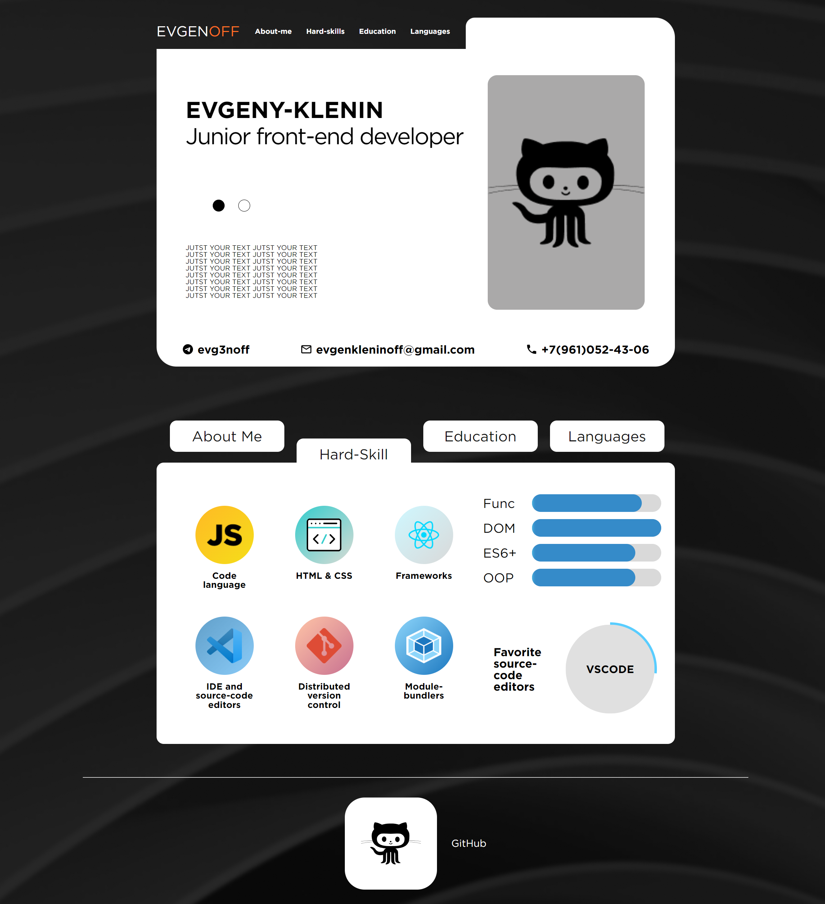
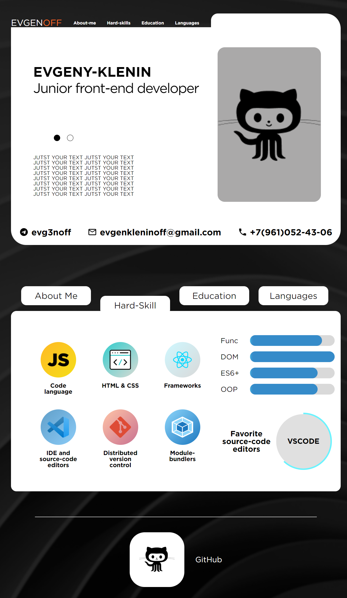
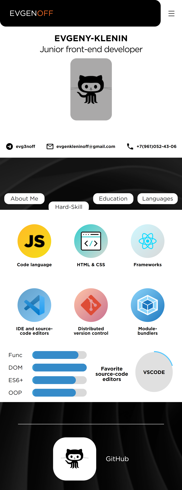
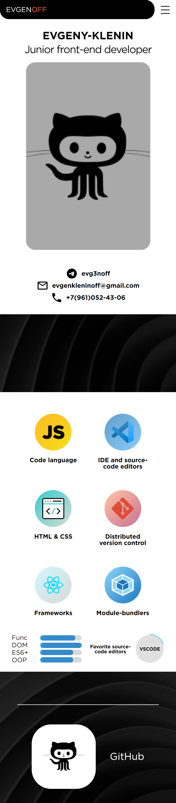

# **Мое резюме**
## Описание

Сайт разработан с использованием React для создания динамичного пользовательского интерфейса. Он предоставляет пользователям возможность ознакомиться с моим профессиональным опытом, образованием и контактной информацией.

## Технологии

- **React**: Библиотека для создания пользовательских интерфейсов.
- **HTML**: Структура веб-страницы.
- **CSS**: Стилизация и оформление.
- **JavaScript**: Логика приложения.

## Установка:

1. Склонируйте репозиторий на свой компьютер.
2. Перейдите в каталог проекта.
3. Установите зависимости (npm install)
4. Запустите сайт на localhost (npm start)

## Screenshots
### NATIVE WIDTH

### 1280PX WIDTH

### 768PX WIDTH

### MOBILE WIDTH

